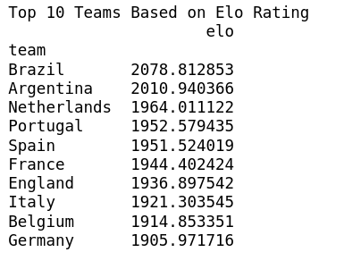
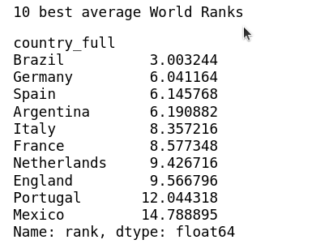
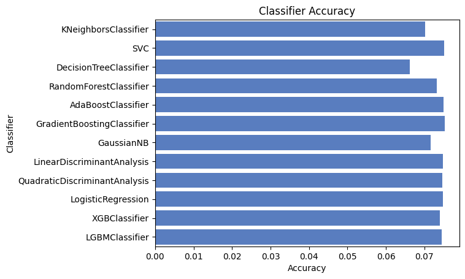
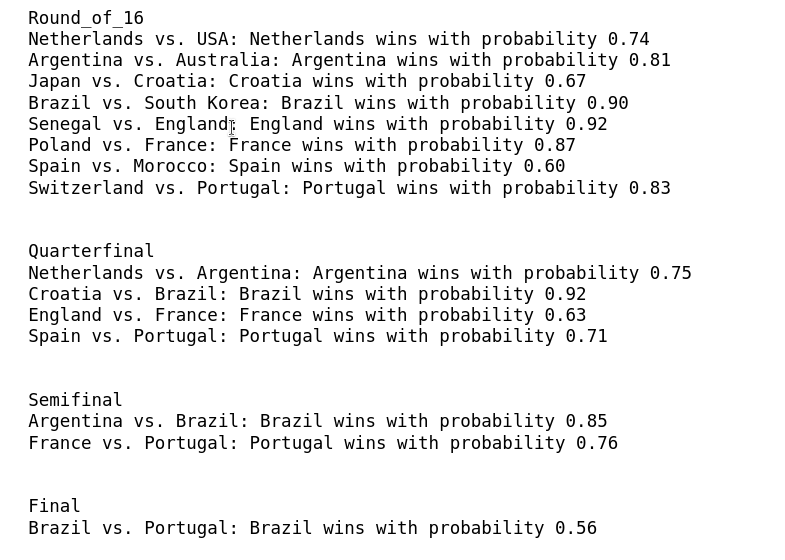

# FIFA WC Prediction
Treating football matches as a classification problem and getting the probability of each class from of matches from ro16 up till finals using various ML classification algorithms.

    Why start from RO16?
   World Cup comes in with a lot of surprises with group stages bringing even crazier ones. For example in 2018 the defending champions Germany were the favourites to win but were eliminated in group stages. I expected some good teams to be eliminated here only (which did end up happening) and didn't want to make my predictions based on them.
   Anyways I started from ro16 because I procastinated for over a week before finally starting to work on this and by the time it reached finishing stages, group stages were almost done.

---
## Approach
  Decide input, output features of the model -> Find dataset -> Decide which Algorithm to use.
### Input and outputs of the Model
I can't even list down all the factors which effect the result of a football match let alone use all of them. I had to chose some major ones.
There are 2 aspects to this
 
 - Overall team based features - historical performance in wc, team ranking, h2h results with opponent, recent team performance, stage at which match is played (friendlies,wc,etc).
 - Individual players based features - recent performance of each individual player

I decided to go with Team based features as that, I believe, is a better representation of a team's strength in this competition.
After taking some external opinions and some trial error, I finally decided the following inputs - 

- [`Elo Ratings`](https://en.wikipedia.org/wiki/Elo_rating_system) 

-  `Point difference` - points assigned to each team by FIFA
- `Average` FIFA rank - 

emphasis on average, exact FIFA rankings are plain stupid and not reliable. Average of both the teams represents the recent performance and consistency.

- `Rank Differece`  - a base representation of both team's strength
- `Stake` - the stage at which the match is played. Friendlies were ignored.

For outputs initially probability of all 3 scenarios - win, draw, lose were considered. In some cases when both teams had a competitive elo rating, the draw probability was > 0.5 (fra vs eng for instance had 0.78).
To also had to decide which teams to send to next round and with such high draw probability wasn't obvious, so draw class was skipped.

### Dataset
Based on the input features I couldnt find a single dataset with all the information, so I decided to go with multiple dataset, extract the relevant info from each and merge them.

- [Qatar wc 2022](https://www.kaggle.com/datasets/brenda89/fifa-world-cup-2022)
- [International football results from 1872 to 2022](https://www.kaggle.com/datasets/martj42/international-football-results-from-1872-to-2017)
- [FIFA World Ranking 1992-2022](https://www.kaggle.com/datasets/cashncarry/fifaworldranking)

### Model

Initially it was just Logistic Regression and KNN, tried some more and finally trained the entire thing on all the classifiers which seemed suitable for this
 - KNN
 - SVC
 - LogisticRegression
 - DecisionTreeClassifier
 - RandomForestClassifier
 - XGBClassifier
 - LGBMClassifier 
 - AdaBoostClassifier
 - GradientBoostingClassifier
 - GaussianNB
 - LinearDiscriminantAnalysis
 - QuadraticDiscriminantAnalysis

 more on them [here](https://scikit-learn.org/stable/auto_examples/classification/plot_classifier_comparison.html)

This is the result of each indiviual classifier on test set. Highest accuracy was in .75-.80  range which was well expected.
 

 For making the predictions the weighted sum of xgb and qda model was taken.

## Results

### Brazil wins the FIFA WC 2022 with probability 0.42

## what's missing?

> Randomness

The model has a learnt some sort of a `strength function` of each team and makes predictions based on it. And they're pretty decent and similar to what humans would predict(Brazil is indeed the favourite for this wc).

But thats not enough, there's just too much minute details effecting a match which results in large entropy. Human intuition does not take that into consideration. Models don't either(yet).

